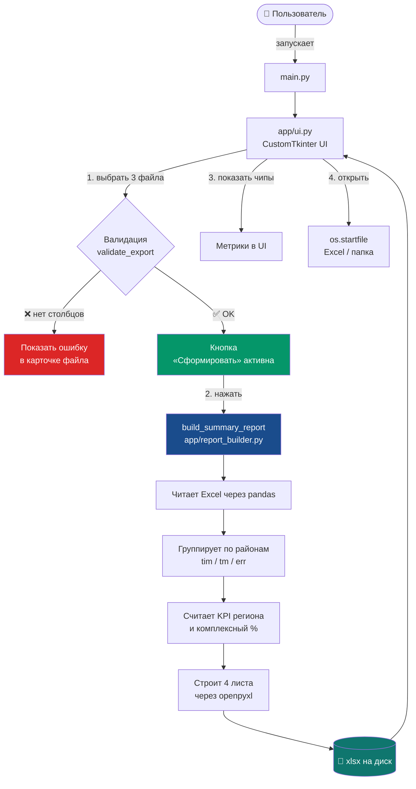

# Мотивирующий мониторинг — сводный отчёт
Десктопное приложение на Python для автоматического построения сводного Excel-отчёта
по результатам мотивирующего мониторинга школьных пищеблоков.
Загружаете три выгрузки — получаете готовый многостраничный Excel-отчёт
с показателями по региону, районам, ранжированием и детализацией ошибок СанПиН.
---
## Содержание
- [Возможности](#возможности)
- [Скриншот интерфейса](#скриншот-интерфейса)
- [Архитектура](#архитектура)
- [Структура проекта](#структура-проекта)
- [Требования к входным файлам](#требования-к-входным-файлам)
- [Что попадает в отчёт](#что-попадает-в-отчёт)
- [Установка и запуск](#установка-и-запуск)
- [Сборка EXE](#сборка-exe)
- [Логика расчётов](#логика-расчётов)
- [Цветовая шкала](#цветовая-шкала)
- [Возможные ошибки](#возможные-ошибки)
- [Лицензия](#лицензия)
---
## Возможности
- 📥 **Три выгрузки Excel** — своевременность, типовое меню, ошибки СанПиН.
- ✅ **Автоматическая валидация** — проверяет наличие обязательных столбцов
  и числовых данных ещё до генерации.
- 📊 **Сводный Excel-отчёт из 4 листов**:
  - Сводка по региону (KPI + итоговое покрытие)
  - По районам (детальная таблица с подсветкой)
  - СанПиН по районам (детализация + топ ошибок)
  - Рейтинг районов (с медалями за топ-3)
- 🎨 **Цветовая индикация** — зелёный / янтарный / красный по порогам.
- 🖥 **Современный UI** на `customtkinter` — карточки файлов, чипы метрик,
  прогресс-бар, кнопки «Открыть Excel» и «Открыть папку».
- 📦 **Работает как EXE** — людям без Python достаточно одного файла.

## Архитектура

MotivReportApp/
├── main.py                  # точка входа
├── requirements.txt         # зависимости
├── build.bat                # скрипт сборки exe (Windows)
├── README.md                # этот файл
└── app/
    ├── __init__.py          # обязателен для сборки в exe
    ├── ui.py                # интерфейс: FileCard, MetricChip, App
    ├── theme.py             # цвета, шрифты, константы, REQUIRED_COLUMNS
    └── report_builder.py    # логика: валидация + построение xlsx

## Требования к входным файлам

Все три файла — `.xlsx` / `.xlsm` / `.xls`. Имена столбцов должны совпадать **точно**.

### 1. Своевременность размещения меню

|Столбец|Тип|
|---|---|
|`Регион`|текст|
|`Район`|текст|
|`Пищеблок`|текст|
|`Процент Своевременности`|число (0–100)|

### 2. Соответствие типовому меню

|Столбец|Тип|
|---|---|
|`Пищеблок Наименование`|текст|
|`Район`|текст|
|`Дата`|дата|
|`Число Несоблюдений`|число|
|`Процент Соблюдения`|число (0–100)|
|`Замечания`|текст|

### 3. Ошибки по СанПиН

|Столбец|Тип|
|---|---|
|`Район`|текст|
|`Пищеблок`|текст|
|`Дата`|дата|
|`Прием Пищи`|текст|
|`Ошибка`|текст|

> Если столбца нет — приложение покажет красную плашку **«ошибка»**  
> в карточке файла и не даст сформировать отчёт.

---

## Что попадает в отчёт

|Лист|Содержание|
|---|---|
|**Сводка по региону**|3 KPI-строки (своевременность, соответствие ТМ, СанПиН), итоговое покрытие, лучшие/отстающие районы, шкала оценки|
|**По районам**|Таблица: № / район / своевременность (средний %, пищеблоков, 100%, ≥75%) / соответствие ТМ (то же) / СанПиН (ошибок, пищеблоков) / комплексный %|
|**СанПиН по районам**|Сводка по районам + список районов без ошибок + топ типов ошибок|
|**Рейтинг районов**|Сортировка по комплексному %, медали за топ-3, подсветка|

---

## Установка и запуск

### Локально (для разработки)

# 1. Клонировать / распаковать проект
cd MotivReportApp
# 2. Создать виртуальное окружение
python -m venv venv
venv\Scripts\activate
# 3. Установить зависимости
pip install -r requirements.txt
# 4. Запустить
python main.py

## Логика расчётов

**Формулы:**

- Комплексный % района: `(своевременность + соответствие ТМ) / 2`
    
- Комплексный % региона: `(среднее tim + среднее tm) / 2`
    
- СанПиН-риск: `0` → низкий, `1–20` → низкий, `21–50` → средний, `>50` → высокий

## Цветовая шкала

| Показатель                    | 🟢   | 🟡    | 🔴   |
| ----------------------------- | ---- | ----- | ---- |
| Проценты (tim, tm, composite) | ≥ 95 | 75–94 | < 75 |
| Ошибки СанПиН                 | 0    | 1–20  | > 20 |
## Возможные ошибки

|Сообщение|Причина|Что делать|
|---|---|---|
|`Файл не найден: …`|путь пропал|выбрать файл заново|
|`Ожидается Excel-файл (.xlsx)`|не тот формат|сохранить как `.xlsx`|
|`Файл «…» пустой`|0 строк|проверить выгрузку|
|`В файле «…» нет столбцов: …`|не совпадают имена|переименовать столбцы точно как в таблице выше|
|`В выгрузке … нет числовых процентов`|проценты текстом / пусто|привести к числам|
|`Не удалось сохранить отчёт — файл открыт…`|xlsx открыт в Excel|закрыть Excel и повторить|
|EXE не запускается / чёрное окно CTk|не собрано с `--collect-all customtkinter`|пересобрать с этим ключом|
|EXE падает с ошибкой pandas|Python 3.13/3.14|перейти на 3.11–3.12 и пересобрать|

---

## Лицензия
GNU GENERAL PUBLIC LICENSE Version 3, 29 June 2007